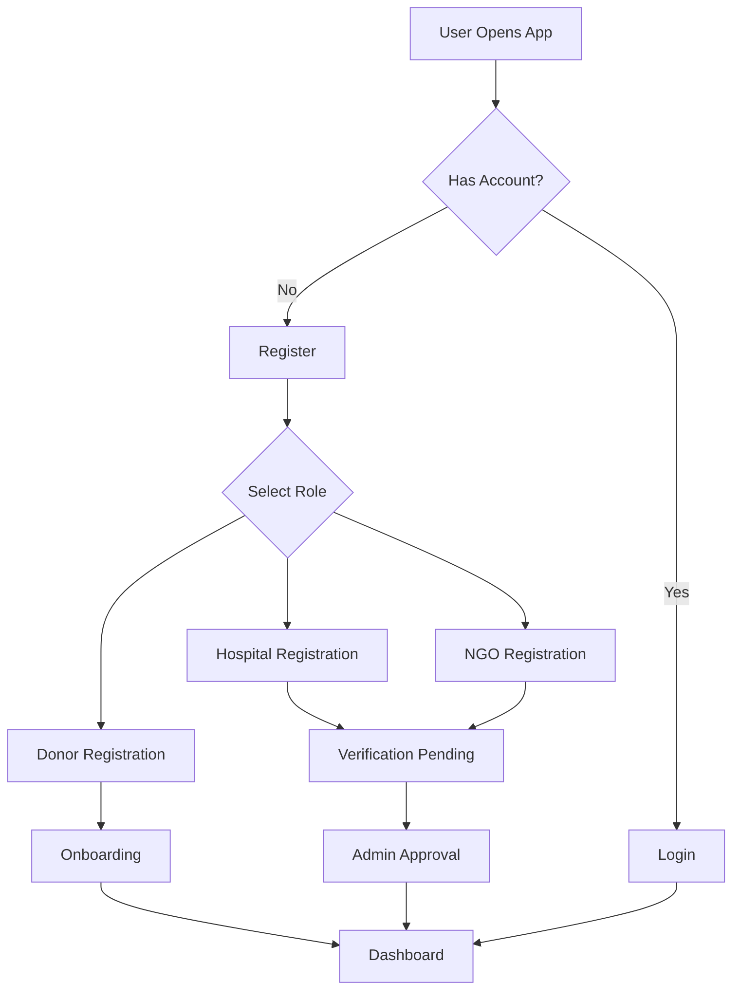

# BloodHub India - Comprehensive Database Architecture & Feature Relationship Plan

## Table of Contents
1. [System Overview](#system-overview)
2. [User Roles & Authentication](#user-roles--authentication)
3. [Firestore Collections Schema](#firestore-collections-schema)
4. [Data Relationships](#data-relationships)
5. [Feature-to-Database Mapping](#feature-to-database-mapping)
6. [Security Rules](#security-rules)
7. [Implementation Roadmap](#implementation-roadmap)

---

## 1. System Overview

### 1.1 Application Architecture
```
┌─────────────────────────────────────────────────────────────┐
│                     Firebase Authentication                  │
│  (Google OAuth, Phone/OTP, Email/Password)                  │
└─────────────────────────────────────────────────────────────┘
                              ↓
┌─────────────────────────────────────────────────────────────┐
│                        User Roles                            │
│   Donor  │  Hospital  │  NGO  │  Admin                      │
└─────────────────────────────────────────────────────────────┘
                              ↓
┌─────────────────────────────────────────────────────────────┐
│                    Firestore Database                        │
│  Collections: users, donations, requests, campaigns,         │
│  hospitals, ngos, appointments, inventory, notifications     │
└─────────────────────────────────────────────────────────────┘
```

### 1.2 Core Features by Role

**Donor:**
- Profile management
- Blood donation history
- Emergency request notifications
- Find nearby blood camps
- Gamification (levels, badges, achievements)
- Donation scheduling

**Hospital:**
- Blood inventory management
- Emergency blood requests
- Donor appointment scheduling
- Request tracking
- Expiry management

**NGO:**
- Campaign management
- Donor community engagement
- Volunteer coordination
- Partnership tracking
- Impact analytics

**Admin:**
- Platform-wide monitoring
- User management
- Organization verification
- Emergency response coordination
- Analytics & reporting

---

## 2. User Roles & Authentication

### 2.1 Authentication Flow



### 2.2 User Role Hierarchy

```
Admin (Highest Authority)
  ├── Approve/Reject Organizations
  ├── Manage All Users
  ├── System Configuration
  └── Platform Analytics

Hospital (Organization)
  ├── Manage Inventory
  ├── Create Requests
  ├── Schedule Appointments
  └── Track Donors

NGO (Organization)
  ├── Create Campaigns
  ├── Manage Volunteers
  ├── Donor Engagement
  └── Partnership Management

Donor (Individual)
  ├── View Profile
  ├── Donate Blood
  ├── View History
  └── Respond to Requests
```

---

## 3. Firestore Collections Schema

### 3.1 Collection: `users`
**Purpose:** Store all user information (Donors, Hospitals, NGOs, Admins)

```typescript
interface User {
  // Authentication Fields
  uid: string;                    // Firebase Auth UID (Document ID)
  email: string | null;
  phoneNumber: string | null;
  displayName: string | null;
  photoURL: string | null;

  // Role & Status
  role: 'donor' | 'hospital' | 'ngo' | 'admin';
  status: 'active' | 'inactive' | 'suspended' | 'pending_verification';
  verified: boolean;              // For hospitals and NGOs

  // Common Fields
  createdAt: Timestamp;
  lastLoginAt: Timestamp;
  onboardingCompleted: boolean;

  // Location
  address?: string;
  city: string;
  state: string;
  postalCode?: string;
  country: string;
  location?: {
    latitude: number;
    longitude: number;
  };

  // Donor Specific Fields
  bloodType?: 'A+' | 'A-' | 'B+' | 'B-' | 'AB+' | 'AB-' | 'O+' | 'O-';
  gender?: 'Male' | 'Female' | 'Other';
  dateOfBirth?: Timestamp;
  isAvailable?: boolean;          // Available to donate
  lastDonation?: Timestamp;
  totalDonations?: number;
  medicalConditions?: string;
  occupation?: string;
  donorLevel?: string;            // New Donor, Rookie, Regular, Super, Hero, Legend, Champion
  impactScore?: number;           // Gamification score
  badges?: string[];              // Array of badge IDs

  // Hospital Specific Fields
  hospitalName?: string;
  hospitalType?: 'government' | 'private' | 'trust';
  licenseNumber?: string;
  contactPerson?: string;
  operatingHours?: string;
  facilities?: string[];

  // NGO Specific Fields
  organizationName?: string;
  ngoType?: 'registered' | 'trust' | 'society';
  registrationNumber?: string;
  foundedYear?: number;
  mission?: string;

  // Preferences
  preferredLanguage?: string;
  notificationPreferences?: {
    email: boolean;
    sms: boolean;
    push: boolean;
    emergencyAlerts: boolean;
  };

  // Metadata
  howHeardAboutUs?: string;
  interestedInVolunteering?: boolean;
}
```

### 3.2 Collection: `donations`
**Purpose:** Track all blood donation records

```typescript
interface Donation {
  id: string;                     // Auto-generated
  donorId: string;                // Reference to users collection
  donorName: string;              // Denormalized for quick access
  donorBloodType: string;

  // Donation Details
  hospitalId: string;             // Reference to users collection (hospital)
  hospitalName: string;
  donationDate: Timestamp;
  units: number;                  // Usually 1 unit = 450ml
  bloodType: string;

  // Status
  status: 'scheduled' | 'completed' | 'cancelled';

  // Medical Info
  hemoglobinLevel?: number;
  bloodPressure?: string;
  weight?: number;
  medicalCheckPassed: boolean;

  // Tracking
  requestId?: string;             // If responding to a request
  campaignId?: string;            // If part of a campaign

  // Location
  location: {
    city: string;
    state: string;
    latitude?: number;
    longitude?: number;
  };

  // Metadata
  createdAt: Timestamp;
  updatedAt: Timestamp;
  notes?: string;
}
```

### 3.3 Collection: `bloodRequests`
**Purpose:** Emergency and regular blood requests

```typescript
interface BloodRequest {
  id: string;                     // Auto-generated

  // Requester Info
  requesterId: string;            // Hospital ID
  requesterName: string;
  requesterType: 'hospital' | 'individual';

  // Request Details
  bloodType: string;
  units: number;
  urgency: 'critical' | 'high' | 'medium' | 'low';
  reason?: string;
  patientName?: string;
  patientAge?: number;

  // Status
  status: 'active' | 'fulfilled' | 'partially_fulfilled' | 'expired' | 'cancelled';
  unitsReceived: number;
  unitsRequired: number;

  // Location
  location: {
    address: string;
    city: string;
    state: string;
    latitude: number;
    longitude: number;
  };

  // Contact
  contactPerson: string;
  contactPhone: string;

  // Timing
  requestedAt: Timestamp;
  neededBy: Timestamp;
  expiresAt: Timestamp;
  fulfilledAt?: Timestamp;

  // Responses
  respondedDonors?: string[];     // Array of donor IDs
  confirmedDonors?: string[];     // Array of donor IDs who confirmed

  // Metadata
  createdAt: Timestamp;
  updatedAt: Timestamp;
  isEmergency: boolean;
}
```

### 3.4 Collection: `bloodInventory`
**Purpose:** Track blood stock at hospitals

```typescript
interface BloodInventory {
  id: string;                     // Auto-generated
  hospitalId: string;             // Reference to users collection

  // Blood Details
  bloodType: string;
  units: number;

  // Status
  status: 'adequate' | 'low' | 'critical' | 'surplus';

  // Expiry Tracking
  batches: Array<{
    batchId: string;
    units: number;
    collectionDate: Timestamp;
    expiryDate: Timestamp;
    status: 'available' | 'reserved' | 'expired' | 'used';
  }>;

  // Thresholds
  criticalLevel: number;          // Units below which it's critical
  lowLevel: number;               // Units below which it's low

  // Analytics
  averageMonthlyUsage: number;
  lastRestocked: Timestamp;

  // Metadata
  updatedAt: Timestamp;
}
```

### 3.5 Collection: `campaigns`
**Purpose:** NGO campaigns and blood drives

```typescript
interface Campaign {
  id: string;                     // Auto-generated

  // Campaign Info
  ngoId: string;                  // Reference to users collection
  ngoName: string;
  title: string;
  description: string;
  type: 'blood-drive' | 'awareness' | 'fundraising' | 'volunteer';

  // Goals
  target: number;                 // Units or people or funds
  achieved: number;
  targetType: 'units' | 'donors' | 'funds' | 'volunteers';

  // Status
  status: 'draft' | 'active' | 'upcoming' | 'completed' | 'cancelled';

  // Timing
  startDate: Timestamp;
  endDate: Timestamp;

  // Location
  location: {
    address: string;
    city: string;
    state: string;
    latitude?: number;
    longitude?: number;
    venue?: string;
  };

  // Participation
  registeredDonors?: string[];    // Array of donor IDs
  confirmedDonors?: string[];
  volunteers?: string[];          // Array of volunteer IDs

  // Media
  bannerImage?: string;           // URL to image
  images?: string[];              // Array of image URLs

  // Partners
  partnerHospitals?: string[];    // Array of hospital IDs
  partnerOrganizations?: string[];

  // Metadata
  createdAt: Timestamp;
  updatedAt: Timestamp;
  createdBy: string;              // User ID
}
```

### 3.6 Collection: `appointments`
**Purpose:** Scheduled donation appointments

```typescript
interface Appointment {
  id: string;                     // Auto-generated

  // Participants
  donorId: string;
  donorName: string;
  donorBloodType: string;
  donorPhone: string;

  hospitalId: string;
  hospitalName: string;
  hospitalAddress: string;

  // Appointment Details
  scheduledDate: Timestamp;
  scheduledTime: string;          // e.g., "10:00 AM"
  duration: number;               // Minutes

  // Status
  status: 'scheduled' | 'confirmed' | 'completed' | 'cancelled' | 'no-show';

  // Purpose
  purpose: 'regular_donation' | 'emergency_request' | 'campaign';
  relatedId?: string;             // Request ID or Campaign ID

  // Reminders
  reminderSent: boolean;
  reminderSentAt?: Timestamp;

  // Completion
  donationId?: string;            // Reference to donations collection
  completedAt?: Timestamp;

  // Notes
  notes?: string;
  cancellationReason?: string;

  // Metadata
  createdAt: Timestamp;
  updatedAt: Timestamp;
}
```

### 3.7 Collection: `volunteers`
**Purpose:** NGO volunteer management

```typescript
interface Volunteer {
  id: string;                     // Auto-generated

  // Volunteer Info
  userId: string;                 // Can be donor or standalone
  name: string;
  email: string;
  phone: string;

  // NGO Association
  ngoId: string;
  ngoName: string;

  // Role
  role: 'coordinator' | 'event_manager' | 'donor_relations' | 'general';
  status: 'active' | 'inactive';

  // Contribution
  hoursContributed: number;
  campaignsParticipated: number;
  eventsOrganized: number;

  // Skills
  skills?: string[];
  availability?: string;          // e.g., "Weekends", "Evenings"

  // Dates
  joinedAt: Timestamp;
  lastActiveAt: Timestamp;

  // Metadata
  createdAt: Timestamp;
  updatedAt: Timestamp;
}
```

### 3.8 Collection: `partnerships`
**Purpose:** Track partnerships between organizations

```typescript
interface Partnership {
  id: string;                     // Auto-generated

  // Partners
  ngoId: string;
  ngoName: string;

  partnerId: string;              // Hospital or Corporate ID
  partnerName: string;
  partnerType: 'hospital' | 'corporate' | 'community' | 'government';

  // Partnership Details
  status: 'active' | 'pending' | 'inactive';
  startDate: Timestamp;
  endDate?: Timestamp;

  // Terms
  termsOfAgreement?: string;

  // Contribution Tracking
  totalDonations: number;         // Blood units contributed
  totalCampaigns: number;
  totalFundsContributed?: number;

  // Contact
  contactPerson?: string;
  contactEmail?: string;
  contactPhone?: string;

  // Metadata
  createdAt: Timestamp;
  updatedAt: Timestamp;
}
```

### 3.9 Collection: `notifications`
**Purpose:** User notifications and alerts

```typescript
interface Notification {
  id: string;                     // Auto-generated

  // Recipient
  userId: string;
  userRole: string;

  // Notification Details
  type: 'emergency_request' | 'appointment_reminder' | 'campaign_invite' |
        'donation_confirmation' | 'verification_status' | 'achievement' | 'general';
  title: string;
  message: string;

  // Status
  read: boolean;
  readAt?: Timestamp;

  // Action
  actionUrl?: string;             // Deep link to relevant page
  actionLabel?: string;           // e.g., "View Request", "Confirm Appointment"

  // Reference
  relatedId?: string;             // ID of related entity
  relatedType?: string;           // Type of related entity

  // Priority
  priority: 'high' | 'medium' | 'low';

  // Metadata
  createdAt: Timestamp;
  expiresAt?: Timestamp;
}
```

### 3.10 Collection: `badges`
**Purpose:** Gamification badges and achievements

```typescript
interface Badge {
  id: string;                     // Auto-generated

  // Badge Info
  name: string;
  description: string;
  icon: string;                   // Icon identifier or URL
  category: 'milestone' | 'achievement' | 'special';

  // Criteria
  criteria: {
    type: 'donation_count' | 'streak' | 'campaign_participation' |
          'emergency_response' | 'special_event';
    threshold?: number;
    condition?: string;
  };

  // Rarity
  rarity: 'common' | 'rare' | 'epic' | 'legendary';

  // Points
  pointsAwarded: number;

  // Metadata
  createdAt: Timestamp;
}
```

### 3.11 Collection: `userBadges`
**Purpose:** Track badges earned by users

```typescript
interface UserBadge {
  id: string;                     // Auto-generated
  userId: string;
  badgeId: string;

  // Earned Details
  earnedAt: Timestamp;
  earnedFor?: string;             // Description of achievement

  // Display
  isDisplayed: boolean;           // Show on profile
  displayOrder?: number;
}
```

### 3.12 Collection: `verificationRequests`
**Purpose:** Track hospital/NGO verification requests

```typescript
interface VerificationRequest {
  id: string;                     // Auto-generated

  // Organization Info
  userId: string;                 // Hospital or NGO user ID
  organizationName: string;
  organizationType: 'hospital' | 'ngo';

  // Documents
  documents: Array<{
    type: 'license' | 'registration' | 'tax_certificate' | 'address_proof' | 'other';
    name: string;
    url: string;                  // Storage URL
    uploadedAt: Timestamp;
  }>;

  // Status
  status: 'pending' | 'under_review' | 'approved' | 'rejected';

  // Admin Review
  reviewedBy?: string;            // Admin user ID
  reviewedAt?: Timestamp;
  reviewNotes?: string;
  rejectionReason?: string;

  // Location
  location: {
    address: string;
    city: string;
    state: string;
    postalCode: string;
  };

  // Contact
  contactPerson: string;
  contactEmail: string;
  contactPhone: string;

  // Metadata
  submittedAt: Timestamp;
  updatedAt: Timestamp;
}
```

### 3.13 Collection: `analytics`
**Purpose:** Store platform analytics data

```typescript
interface Analytics {
  id: string;                     // Date-based ID (e.g., "2024-06-15")
  date: Timestamp;

  // User Metrics
  totalUsers: number;
  newUsers: number;
  activeUsers: number;
  usersByRole: {
    donors: number;
    hospitals: number;
    ngos: number;
  };

  // Donation Metrics
  totalDonations: number;
  donationsByBloodType: {
    [key: string]: number;        // e.g., "A+": 45
  };
  donationsByCity: {
    [key: string]: number;
  };

  // Request Metrics
  totalRequests: number;
  fulfilledRequests: number;
  pendingRequests: number;
  averageResponseTime: number;    // Minutes

  // Campaign Metrics
  activeCampaigns: number;
  completedCampaigns: number;
  totalParticipation: number;

  // Inventory Metrics
  totalBloodUnits: number;
  criticalInventories: number;
  lowInventories: number;

  // Platform Health
  systemUptime: number;           // Percentage
  errorRate: number;

  // Generated At
  generatedAt: Timestamp;
}
```

---

## 4. Data Relationships

### 4.1 Relationship Diagram

```
users (donors)
  ├── donations (1:N)
  ├── bloodRequests (1:N) - as responder
  ├── appointments (1:N)
  ├── userBadges (1:N)
  ├── notifications (1:N)
  └── campaigns (N:N) - as participant

users (hospitals)
  ├── bloodInventory (1:N)
  ├── bloodRequests (1:N) - as requester
  ├── appointments (1:N)
  ├── donations (1:N) - received at
  ├── verificationRequests (1:1)
  └── partnerships (1:N)

users (ngos)
  ├── campaigns (1:N) - created
  ├── volunteers (1:N)
  ├── partnerships (1:N)
  ├── verificationRequests (1:1)
  └── notifications (1:N)

users (admin)
  ├── verificationRequests (1:N) - reviewed by
  └── analytics (1:N) - generated by
```

### 4.2 Key Relationships

1. **Donor → Donation**: One donor can have multiple donations
2. **Hospital → Blood Request**: One hospital can create multiple requests
3. **Donor → Blood Request**: Many donors can respond to one request (N:N)
4. **NGO → Campaign**: One NGO can create multiple campaigns
5. **Campaign → Donor**: Many donors can participate in many campaigns (N:N)
6. **Hospital → Blood Inventory**: One hospital has multiple blood type inventories
7. **Donor → Appointment**: One donor can have multiple appointments
8. **Hospital → Appointment**: One hospital can have multiple appointments
9. **NGO → Volunteer**: One NGO can have multiple volunteers
10. **NGO → Partnership**: One NGO can have partnerships with multiple organizations

---

## 5. Feature-to-Database Mapping

### 5.1 Donor Dashboard Features

| Feature | Collections Used | Operations |
|---------|-----------------|------------|
| Profile Display | `users` | READ user by uid |
| Donation History | `donations` | QUERY where donorId == uid |
| Impact Stats | `donations`, `userBadges` | COUNT donations, CALCULATE lives saved |
| Eligibility Status | `donations` | GET last donation, CALCULATE days since |
| Emergency Requests | `bloodRequests` | QUERY where bloodType matches AND status='active' |
| Upcoming Appointments | `appointments` | QUERY where donorId == uid AND status='scheduled' |
| Badges & Achievements | `userBadges`, `badges` | JOIN userBadges with badges |
| Nearby Blood Camps | `campaigns` | GEO QUERY where type='blood-drive' |

### 5.2 Hospital Dashboard Features

| Feature | Collections Used | Operations |
|---------|-----------------|------------|
| Blood Inventory | `bloodInventory` | QUERY where hospitalId == uid |
| Create Request | `bloodRequests` | CREATE new request |
| Emergency Requests | `bloodRequests` | QUERY where requesterId == uid |
| Donor Appointments | `appointments` | QUERY where hospitalId == uid |
| Expiry Tracking | `bloodInventory.batches` | FILTER where expiryDate < 7 days |
| Inventory Updates | `bloodInventory` | UPDATE units and batches |
| Request Responses | `bloodRequests`, `users` | GET respondedDonors and JOIN with users |

### 5.3 NGO Dashboard Features

| Feature | Collections Used | Operations |
|---------|-----------------|------------|
| Campaign Management | `campaigns` | QUERY where ngoId == uid |
| Create Campaign | `campaigns` | CREATE new campaign |
| Donor Community | `users`, `donations` | AGGREGATE donor stats |
| Volunteer Management | `volunteers` | QUERY where ngoId == uid |
| Partnership Tracking | `partnerships` | QUERY where ngoId == uid |
| Campaign Analytics | `campaigns`, `donations` | JOIN campaigns with donations |
| Donor Engagement | `users`, `campaigns` | GET registered/confirmed donors |

### 5.4 Admin Dashboard Features

| Feature | Collections Used | Operations |
|---------|-----------------|------------|
| Platform Statistics | `analytics`, `users` | AGGREGATE all metrics |
| User Management | `users` | QUERY all users with filters |
| Organization Verification | `verificationRequests` | QUERY pending requests, UPDATE status |
| Emergency Monitoring | `bloodRequests` | QUERY critical requests |
| Blood Inventory Overview | `bloodInventory` | AGGREGATE across all hospitals |
| System Alerts | `bloodRequests`, `bloodInventory` | DETECT critical situations |
| Reports Generation | `analytics`, all collections | AGGREGATE data for reports |

### 5.5 Common Features

| Feature | Collections Used | Operations |
|---------|-----------------|------------|
| User Registration | `users` | CREATE new user document |
| User Login | `users` | READ user by uid, UPDATE lastLoginAt |
| Profile Update | `users` | UPDATE user document |
| Notifications | `notifications` | CREATE, READ, UPDATE (mark as read) |
| Search Donors | `users` | QUERY where role='donor' AND filters |
| Location-based Search | `users`, `campaigns` | GEO QUERY with location filters |

---

## 6. Security Rules

### 6.1 Firestore Security Rules Structure

```javascript
rules_version = '2';
service cloud.firestore {
  match /databases/{database}/documents {

    // Helper Functions
    function isAuthenticated() {
      return request.auth != null;
    }

    function isOwner(userId) {
      return request.auth.uid == userId;
    }

    function hasRole(role) {
      return get(/databases/$(database)/documents/users/$(request.auth.uid)).data.role == role;
    }

    function isAdmin() {
      return hasRole('admin');
    }

    function isDonor() {
      return hasRole('donor');
    }

    function isHospital() {
      return hasRole('hospital');
    }

    function isNGO() {
      return hasRole('ngo');
    }

    function isVerified() {
      return get(/databases/$(database)/documents/users/$(request.auth.uid)).data.verified == true;
    }

    // Users Collection
    match /users/{userId} {
      // Anyone can read public user data, but sensitive fields need ownership
      allow read: if isAuthenticated();

      // Users can create their own document during registration
      allow create: if isAuthenticated() && isOwner(userId);

      // Users can update their own data, admins can update any
      allow update: if isAuthenticated() && (isOwner(userId) || isAdmin());

      // Only admins can delete users
      allow delete: if isAdmin();
    }

    // Donations Collection
    match /donations/{donationId} {
      // Donors can read their own, hospitals can read received, admins can read all
      allow read: if isAuthenticated() &&
        (isDonor() && resource.data.donorId == request.auth.uid ||
         isHospital() && resource.data.hospitalId == request.auth.uid ||
         isAdmin());

      // Hospitals and admins can create donations
      allow create: if isAuthenticated() && (isHospital() || isAdmin());

      // Only the creating hospital or admin can update
      allow update: if isAuthenticated() &&
        (isHospital() && resource.data.hospitalId == request.auth.uid || isAdmin());

      // Only admins can delete
      allow delete: if isAdmin();
    }

    // Blood Requests Collection
    match /bloodRequests/{requestId} {
      // Anyone authenticated can read active requests
      allow read: if isAuthenticated();

      // Only verified hospitals and admins can create requests
      allow create: if isAuthenticated() && ((isHospital() && isVerified()) || isAdmin());

      // Only the requester or admin can update
      allow update: if isAuthenticated() &&
        (resource.data.requesterId == request.auth.uid || isAdmin());

      // Only the requester or admin can delete
      allow delete: if isAuthenticated() &&
        (resource.data.requesterId == request.auth.uid || isAdmin());
    }

    // Blood Inventory Collection
    match /bloodInventory/{inventoryId} {
      // Anyone can read inventory (for searching available blood)
      allow read: if isAuthenticated();

      // Only the hospital or admin can create/update their inventory
      allow create, update: if isAuthenticated() &&
        (resource.data.hospitalId == request.auth.uid || isAdmin());

      // Only admin can delete
      allow delete: if isAdmin();
    }

    // Campaigns Collection
    match /campaigns/{campaignId} {
      // Anyone can read campaigns
      allow read: if isAuthenticated();

      // Only verified NGOs and admins can create campaigns
      allow create: if isAuthenticated() && ((isNGO() && isVerified()) || isAdmin());

      // Only the creating NGO or admin can update
      allow update: if isAuthenticated() &&
        (resource.data.ngoId == request.auth.uid || isAdmin());

      // Only the creating NGO or admin can delete
      allow delete: if isAuthenticated() &&
        (resource.data.ngoId == request.auth.uid || isAdmin());
    }

    // Appointments Collection
    match /appointments/{appointmentId} {
      // Donor and hospital involved, plus admin, can read
      allow read: if isAuthenticated() &&
        (resource.data.donorId == request.auth.uid ||
         resource.data.hospitalId == request.auth.uid ||
         isAdmin());

      // Hospital or donor can create appointments
      allow create: if isAuthenticated() && (isHospital() || isDonor());

      // Involved parties or admin can update
      allow update: if isAuthenticated() &&
        (resource.data.donorId == request.auth.uid ||
         resource.data.hospitalId == request.auth.uid ||
         isAdmin());

      // Only admin can delete
      allow delete: if isAdmin();
    }

    // Volunteers Collection
    match /volunteers/{volunteerId} {
      // NGO and volunteer can read, admin can read all
      allow read: if isAuthenticated() &&
        (resource.data.ngoId == request.auth.uid ||
         resource.data.userId == request.auth.uid ||
         isAdmin());

      // NGO can create volunteers
      allow create: if isAuthenticated() && isNGO();

      // NGO or admin can update
      allow update: if isAuthenticated() &&
        (resource.data.ngoId == request.auth.uid || isAdmin());

      // NGO or admin can delete
      allow delete: if isAuthenticated() &&
        (resource.data.ngoId == request.auth.uid || isAdmin());
    }

    // Partnerships Collection
    match /partnerships/{partnershipId} {
      // Involved parties and admin can read
      allow read: if isAuthenticated() &&
        (resource.data.ngoId == request.auth.uid ||
         resource.data.partnerId == request.auth.uid ||
         isAdmin());

      // NGO or admin can create partnerships
      allow create: if isAuthenticated() && (isNGO() || isAdmin());

      // Involved parties or admin can update
      allow update: if isAuthenticated() &&
        (resource.data.ngoId == request.auth.uid ||
         resource.data.partnerId == request.auth.uid ||
         isAdmin());

      // Only admin can delete
      allow delete: if isAdmin();
    }

    // Notifications Collection
    match /notifications/{notificationId} {
      // Only the recipient or admin can read
      allow read: if isAuthenticated() &&
        (resource.data.userId == request.auth.uid || isAdmin());

      // System and admins can create notifications
      allow create: if isAuthenticated();

      // Recipient can update (mark as read), admin can update any
      allow update: if isAuthenticated() &&
        (resource.data.userId == request.auth.uid || isAdmin());

      // Recipient or admin can delete
      allow delete: if isAuthenticated() &&
        (resource.data.userId == request.auth.uid || isAdmin());
    }

    // Badges Collection (Read-only for users)
    match /badges/{badgeId} {
      allow read: if isAuthenticated();
      allow write: if isAdmin();
    }

    // User Badges Collection
    match /userBadges/{userBadgeId} {
      // User can read their own badges, others can read for display
      allow read: if isAuthenticated();

      // Only system/admin can create badges for users
      allow create: if isAdmin();

      // User can update display preferences, admin can update any
      allow update: if isAuthenticated() &&
        (resource.data.userId == request.auth.uid || isAdmin());

      // Only admin can delete
      allow delete: if isAdmin();
    }

    // Verification Requests Collection
    match /verificationRequests/{requestId} {
      // Requester and admin can read
      allow read: if isAuthenticated() &&
        (resource.data.userId == request.auth.uid || isAdmin());

      // Hospital or NGO can create their verification request
      allow create: if isAuthenticated() && (isHospital() || isNGO());

      // Requester can update until submitted, admin can always update
      allow update: if isAuthenticated() &&
        (resource.data.userId == request.auth.uid || isAdmin());

      // Only admin can delete
      allow delete: if isAdmin();
    }

    // Analytics Collection (Admin only)
    match /analytics/{analyticsId} {
      allow read: if isAuthenticated();
      allow write: if isAdmin();
    }
  }
}
```

---

## 7. Implementation Roadmap

### Phase 1: Foundation (Week 1-2)
**Goal:** Set up database structure and authentication

1. **Database Setup**
   - Create Firestore collections
   - Set up indexes for common queries
   - Implement security rules
   - Test basic CRUD operations

2. **Authentication Enhancement**
   - ✅ Already implemented: Google OAuth, Phone/OTP
   - Add email/password authentication
   - Implement role-based access control
   - Add verification workflow

3. **Data Models**
   - Create TypeScript interfaces (already partially done)
   - Create Firestore converters
   - Set up data validation utilities

### Phase 2: Core Features (Week 3-4)
**Goal:** Implement essential features for each role

1. **Donor Features**
   - Profile management (✅ partially done)
   - Donation history tracking
   - Blood request notifications
   - Appointment scheduling

2. **Hospital Features**
   - Blood inventory management
   - Emergency request creation
   - Appointment management
   - Donor search

3. **NGO Features**
   - Campaign creation and management
   - Volunteer management
   - Basic analytics

4. **Admin Features**
   - User management
   - Verification workflow
   - Platform monitoring

### Phase 3: Advanced Features (Week 5-6)
**Goal:** Add gamification and advanced functionality

1. **Gamification System**
   - Badge system implementation
   - Level progression
   - Impact score calculation
   - Leaderboards

2. **Notification System**
   - Real-time notifications
   - Email notifications
   - SMS notifications (Twilio integration)
   - Push notifications

3. **Analytics & Reporting**
   - Dashboard analytics
   - Report generation
   - Data export functionality

### Phase 4: Optimization & Enhancement (Week 7-8)
**Goal:** Performance optimization and additional features

1. **Performance Optimization**
   - Query optimization
   - Implement caching strategies
   - Lazy loading for large lists
   - Image optimization

2. **Search & Discovery**
   - Algolia integration for advanced search
   - Geolocation-based search
   - Filter and sort functionality

3. **Additional Features**
   - Blood camp finder
   - Donation reminders
   - Health tips section
   - Multi-language support

### Phase 5: Testing & Launch (Week 9-10)
**Goal:** Comprehensive testing and production launch

1. **Testing**
   - Unit testing
   - Integration testing
   - Security testing
   - User acceptance testing

2. **Deployment**
   - Set up production environment
   - Configure Firebase hosting
   - Set up monitoring and alerts
   - Create backup strategy

3. **Documentation**
   - API documentation
   - User guides
   - Admin manual
   - Developer documentation

---

## 8. API Integration Points

### 8.1 Firebase Services Required

1. **Firebase Authentication**
   - Google OAuth
   - Phone Authentication
   - Email/Password
   - Custom claims for roles

2. **Cloud Firestore**
   - All collections listed above
   - Real-time listeners
   - Batch operations
   - Transactions for critical operations

3. **Cloud Storage** (Future)
   - Profile photos
   - Verification documents
   - Campaign images
   - Certificates

4. **Cloud Functions** (Future)
   - Scheduled functions for:
     - Expiry notifications
     - Analytics generation
     - Reminder emails
   - Triggered functions for:
     - Badge awarding
     - Notification sending
     - Data aggregation

5. **Cloud Messaging** (Future)
   - Push notifications
   - Topic-based messaging
   - Device token management

### 8.2 Third-Party Services (Future)

1. **Twilio** - SMS notifications
2. **SendGrid** - Email notifications
3. **Algolia** - Advanced search
4. **Google Maps API** - Location services
5. **Analytics** - Google Analytics, Mixpanel

---

## 9. Data Flow Examples

### 9.1 Emergency Blood Request Flow

```
1. Hospital creates request → bloodRequests collection
2. System queries matching donors → users collection (bloodType match)
3. Send notifications → notifications collection
4. Donor responds → Update bloodRequests.respondedDonors
5. Donor confirms → Update bloodRequests.confirmedDonors
6. Appointment scheduled → appointments collection
7. Donation completed → donations collection
8. Update inventory → bloodInventory collection
9. Update request status → bloodRequests.status = 'fulfilled'
10. Award badge if criteria met → userBadges collection
```

### 9.2 Campaign Creation Flow

```
1. NGO creates campaign → campaigns collection
2. Invite donors → notifications collection
3. Donors register → Update campaigns.registeredDonors
4. Campaign starts → Update campaigns.status
5. Track donations → donations collection with campaignId
6. Update progress → campaigns.achieved
7. Campaign ends → Update campaigns.status = 'completed'
8. Generate analytics → analytics collection
9. Award badges to participants → userBadges collection
```

### 9.3 Donor Registration Flow

```
1. User signs up → Firebase Authentication
2. Create user document → users collection
3. Complete onboarding → Update users.onboardingCompleted
4. Initial badge awarded → userBadges collection
5. Welcome notification → notifications collection
```

---

## 10. Query Patterns & Indexes

### 10.1 Required Composite Indexes

```javascript
// Donations by donor and date
donations: [donorId ASC, donationDate DESC]

// Blood requests by blood type and status
bloodRequests: [bloodType ASC, status ASC, urgency DESC]

// Blood requests by location and urgency
bloodRequests: [location.city ASC, urgency DESC]

// Appointments by hospital and date
appointments: [hospitalId ASC, scheduledDate ASC]

// Campaigns by NGO and status
campaigns: [ngoId ASC, status ASC, startDate DESC]

// Notifications by user and read status
notifications: [userId ASC, read ASC, createdAt DESC]

// User badges by user
userBadges: [userId ASC, earnedAt DESC]

// Volunteers by NGO and status
volunteers: [ngoId ASC, status ASC]
```

### 10.2 Common Query Examples

```typescript
// Find active emergency requests for a blood type in a city
const activeRequests = await db.collection('bloodRequests')
  .where('bloodType', '==', 'O+')
  .where('location.city', '==', 'Mumbai')
  .where('status', '==', 'active')
  .where('urgency', '==', 'critical')
  .orderBy('requestedAt', 'desc')
  .limit(10)
  .get();

// Get donor's donation history
const donations = await db.collection('donations')
  .where('donorId', '==', userId)
  .orderBy('donationDate', 'desc')
  .limit(20)
  .get();

// Find nearby blood camps (requires geohash)
const campaigns = await db.collection('campaigns')
  .where('type', '==', 'blood-drive')
  .where('status', '==', 'active')
  .where('location.city', '==', userCity)
  .get();

// Get hospital's low inventory items
const lowInventory = await db.collection('bloodInventory')
  .where('hospitalId', '==', hospitalId)
  .where('status', 'in', ['low', 'critical'])
  .get();

// Admin: Get pending verification requests
const pendingVerifications = await db.collection('verificationRequests')
  .where('status', '==', 'pending')
  .orderBy('submittedAt', 'asc')
  .get();
```

---

## 11. Best Practices & Recommendations

### 11.1 Data Modeling Best Practices

1. **Denormalization for Performance**
   - Store frequently accessed data together
   - Example: Store donor name in donations collection
   - Trade-off: Storage for read performance

2. **Use Subcollections for One-to-Many**
   - Avoid large arrays
   - Better: `users/{userId}/donations/{donationId}`
   - Current approach is flat for better querying

3. **Implement Soft Deletes**
   - Add `deleted: boolean` field instead of actual deletion
   - Allows for data recovery and audit trails

4. **Use Timestamps Consistently**
   - Always use Firestore `serverTimestamp()`
   - Ensures consistency across time zones

### 11.2 Security Best Practices

1. **Principle of Least Privilege**
   - Users can only access what they need
   - Implemented in security rules

2. **Validate Data on Server**
   - Use Cloud Functions for critical validations
   - Don't rely solely on client-side validation

3. **Audit Trail**
   - Log all critical operations
   - Store in separate `auditLogs` collection

### 11.3 Performance Best Practices

1. **Limit Document Size**
   - Keep documents under 1MB
   - Use references for large related data

2. **Batch Operations**
   - Use batch writes for multiple updates
   - Reduces billing and improves performance

3. **Use Pagination**
   - Implement cursor-based pagination
   - Load data in chunks

4. **Cache Frequently Accessed Data**
   - Use React Query or SWR for caching
   - Reduce Firestore reads

---

## 12. Migration Strategy (If Needed)

### 12.1 Data Migration Steps

1. **Export Existing Data**
   - Use Firestore export functionality
   - Backup all collections

2. **Transform Data**
   - Write migration scripts
   - Map old schema to new schema

3. **Validate Data**
   - Check data integrity
   - Verify relationships

4. **Import to New Structure**
   - Use batch imports
   - Monitor for errors

5. **Verify**
   - Run test queries
   - Check all features

---

## 13. Monitoring & Maintenance

### 13.1 Metrics to Monitor

1. **Usage Metrics**
   - Daily active users
   - Donation counts
   - Request fulfillment rate
   - Campaign participation

2. **Performance Metrics**
   - Query latency
   - Document read/write counts
   - Error rates

3. **Cost Metrics**
   - Firestore operations cost
   - Storage cost
   - Function invocations

### 13.2 Regular Maintenance Tasks

1. **Weekly**
   - Review error logs
   - Check critical alerts
   - Monitor costs

2. **Monthly**
   - Generate analytics reports
   - Review and optimize queries
   - Clean up old notifications

3. **Quarterly**
   - Security audit
   - Performance optimization
   - Feature usage analysis

---

## Conclusion

This comprehensive database architecture provides:
- ✅ Clear separation of concerns by role
- ✅ Scalable structure for growth
- ✅ Efficient query patterns
- ✅ Strong security model
- ✅ Support for all planned features
- ✅ Foundation for future enhancements

Next steps: Begin Phase 1 implementation with database setup and enhanced authentication.
